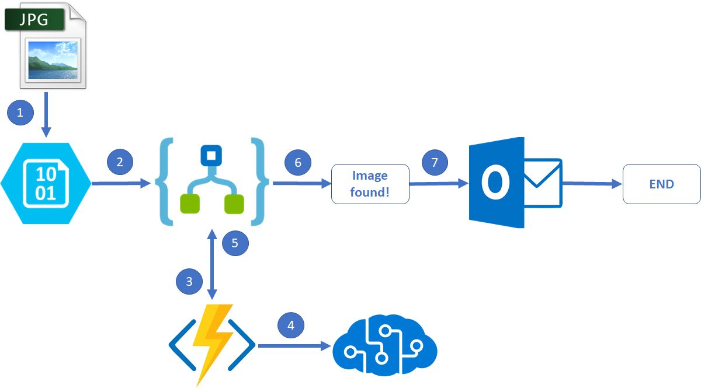

# OceanDebrisRecognition
This repository walks you through implementing an Ai cloud application that detects whether there is some debris found on an image file, and sends a notification via email.

The content of this repository is divided in 4 different Visual Studio solutions:

### TrainCustomVisionApi
This solution contains a .NET Framework console application that creates a Cognitive Services Custom Vision project and trains it to differentiate ocean images from ocean images with some debris on them. Train and test images can be found [here](TrainCustomVisionApi/ImageSet).

### FunctionApp
This solution contains a .NET Framework function app that deploys a single function called `OnNewImage`. It defines a generic webhook trigger and interacts with the Custom Vision prediction API project created by the ``TrainCustomVisionApi`` solution.

**NOTE: You must ensure that the application settings defined in your version of the file `local.settings.json` contain the values for `CustomVisionProjectId`, `CustomVisionApiKey`, `ImagesStorageAccountName`. For more information about testing your functions locally refer to [this article](https://docs.microsoft.com/en-us/azure/azure-functions/functions-develop-vs) and [this article](https://docs.microsoft.com/en-us/azure/azure-functions/functions-run-local#local-settings-file).**

### AzureResourceGroup
This solution contains an Azure Resource Group deployment project that will help you create the needed infrastructure. It has 2 major projects:

#### LogicApp
This project contains the Logic App flow that manages the entire application.

#### OceanDebrisInfrastructure
This project creates the following resources:

* Storage account to send images.
* Application Insights account to track function app performance and custom events.
* Function app under a consumption plan.
* Logic App declared in the [LogicApp](AzureResourceGroup/LogicApp) project.

### PictureUploaderFunctionApp
This solution contains an .NET Framework function app that simulates an edge device uploading images to the storage account on a timer basis. This is not mandatory as this step can be performed manually, but it helps to accelerate the number of occurrences to get some information in Application Insights.

## Walkthrough
Below you will find a representation of the Ai application work flow:

1. An image file gets uploaded to the storage account.
2. The logic app gets triggered due to a blob storage being added or modified. For more details see [this article](https://docs.microsoft.com/en-us/azure/connectors/connectors-create-api-azureblobstorage).
3. The logic app sends a request to the Azure function, sending the blob information in the request body. For more information see [this article](https://docs.microsoft.com/en-us/azure/connectors/apis-list).
4. The Azure function code calls the Custom Vision Prediction API, and determines whether there is an object in the uploaded image. For more information about Custom Vision services see [this article](https://docs.microsoft.com/en-us/azure/cognitive-services/custom-vision-service/home).
5. The Azure function sends a response message back to the Logic App, specifying whether an object was found and the image file URL.
6. The logic app analyzes the Azure function response content. For more details see [this article](https://docs.microsoft.com/en-us/azure/logic-apps/logic-apps-control-flow-conditional-statement).
7. If an object was found by the Cognitive Services API, then an email notification is sent to a certain recipient. For more details see [this article](https://docs.microsoft.com/en-us/azure/connectors/connectors-create-api-office365-outlook).
